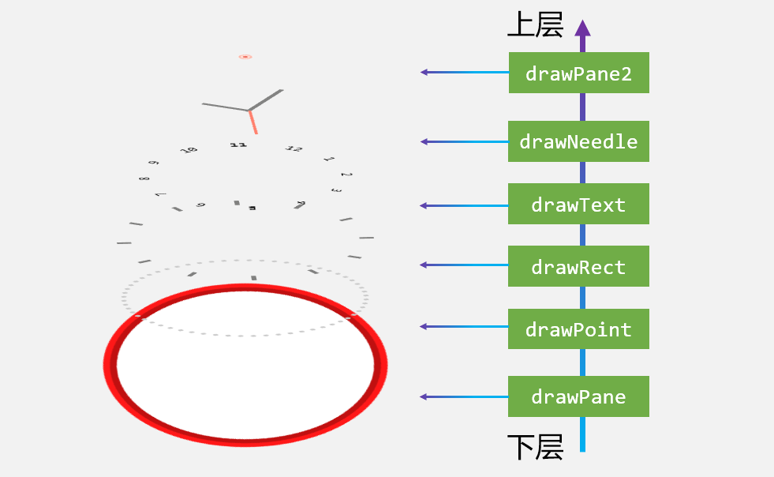
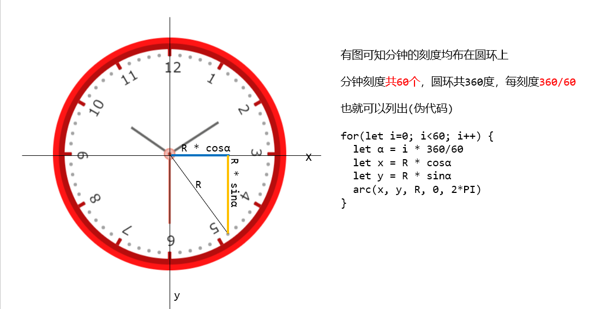
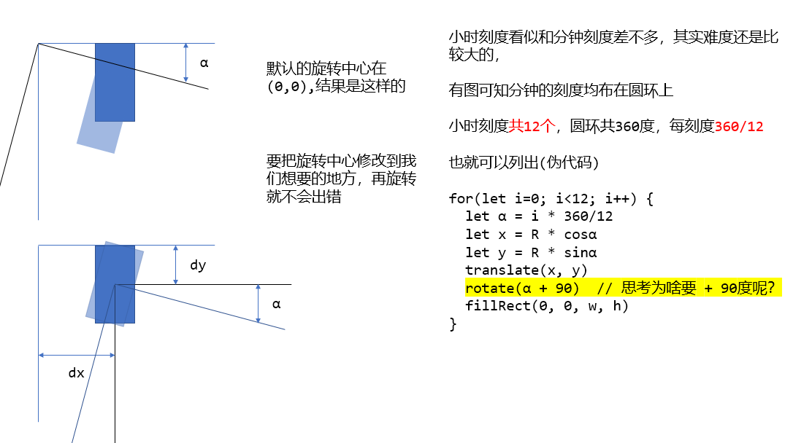
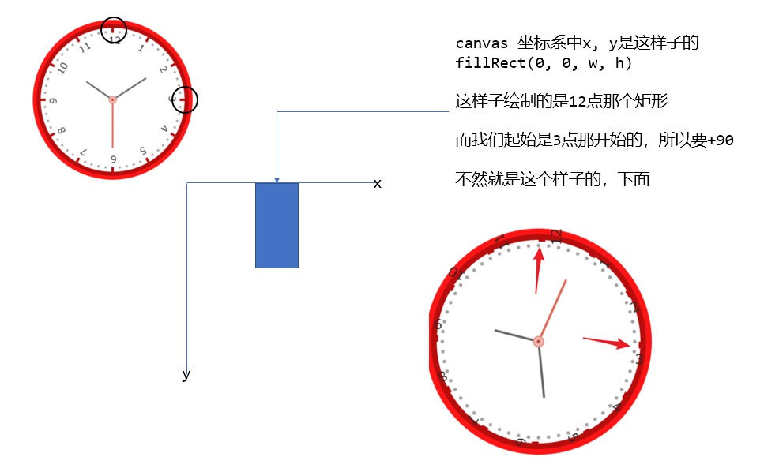

# canvas绘制钟表

## 效果如图所示


## 详细设计过程

### 1. 分析

这个图形较为简单，使用的canvas api

- arc() 画圆 

+ fillRect() 画矩形 
+ fillText() 画字

### 2. 拆分 & 图层

图形虽简单，但由于涉及的图形较多，这里面有一些覆盖关系，所以要分析图层关系，这也是我们后面要依次实现的函数，如下图所示



### 3. 绘制

1. 外圆盘绘制 drawPane

   绘制圆盘的过程其实很简单

   ```
   // 绘制圆api
   arc(x, y, r, 0, 2*PI)
   
   // 由于绘制的圆较多，可以封装这样一个函数
   function drawArc(x, y, r, color) {...}
   
   // 依次绘制3个圆
   drawArc(200, 200, 200, '#ff1515')
   drawArc(200, 200, 190, '#b70d0d')
   drawArc(200, 200, 180, '#ffffff')
   ```

2. 绘制分钟刻度 drawPoint

   分钟刻度共60个，圆环共360度，每刻度360/60，然后这里面使用三角函数求解即可

   ```
   // 伪代码
   for(let i=0; i<60; i++) {
     let α = i * 360/60
     let x = R * cosα
     let y = R * sinα
     arc(x, y, R, 0, 2*PI)
   }
   ```

   

3. 绘制矩形 drawRect

   小时刻度共12个，圆环共360度，每刻度360/12，小时刻度看似和分钟刻度差不多，其实难度还是比较大的，

   因为默认的旋转中心在(0,0)，每次绘制需要手动的修改旋转中心

   ```
   // 伪代码
   for(let i=0; i<12; i++) {
     let α = i * 360/12
     let x = R * cosα
     let y = R * sinα
     translate(x, y)
     rotate(α + 90)  // 思考为啥要 + 90度呢？
     fillRect(0, 0, w, h)
   }
   ```

   
   
   
   4. drawNeedle
   
      有了前面的基础，绘制指针就会简单很多，由于绘制指针和小时刻度相似，这里把它抽出来，做成单独的函数
   
      ```
      drawScale(x, y, w, h, angle, color) {...}
      ```
   
      计算指针的角度，这个看似难，其实非常简单
   
      举个例子
   
      - 秒针、分针共60刻度，均分360度 -> 360/60
   
      - 时针共12刻度，均分360度 -> 360/12
   
      这样做还是不够的，还有考虑秒对分的影响、秒分对时的影响，所以可以这样换算
   
      ```
      // 偏移角度 = 折算的当前时刻数 * 单位角度
      
      sec * 360/60
      (min + sec/60) * 360/60
      (hour + min/60 + sec/60/60) * 360/12
      ```
   
   5. drawPane2
   
      与drawPane相同就不赘述了

## 代码


